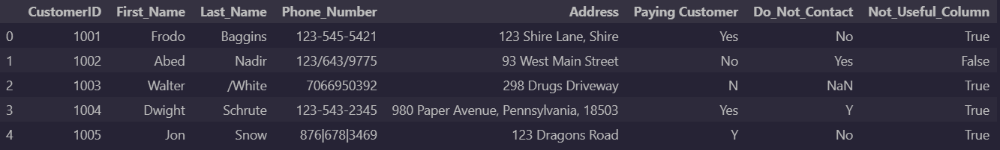

# DC_Customer_Call_Data_Cleaning

## Introduction
In this project, this focuses on the aspect of **Data Cleaning** in Python that is given from a CSV file of a list of customer's contact information. 
This project is guided by a YouTube Channel: [Alex The Analyst](https://www.youtube.com/watch?v=bDhvCp3_lYw&ab_channel=AlexTheAnalyst) to help
gain insight of how we can data clean in Python using Pandas library before we begin our data analysis (data analysis not included).

## Tech Stack
1. Visual Studio Code
2. Jupyter Notebook
3. Python (Pandas)

## Features
This project shows how we data cleaning our csv file that is saved in a dataFrame. It shows how we deal with duplicated and missing values, 
dropping columns from a dataFrame, and formatting string values by using strip method that is built in Python. 

## Process
Before starting on data cleaning project, I need to understand how data cleaning works for data analytics, so I saw *Alex the Analyst*'s
video explaining how we can data clean in Python with Pandas library since not all of our data is very clean or perfect, and it can contain 
duplicates and missing values that we do not want to any issues with our findings. During the data cleaning project, I already have experience
working with missing and duplicated values because most of *Exploratory Data Analysis* deals with those task first before starting making some
queries for our data visualization, but formatting string values takes most of the task of this project. When we were working on formatting
string values, we wanted to format the names in the list of customers because the names contain special characters that should not be in the 
customer's name, so we use the strip method that is built-in on Python to take special character out of the string values in first and last names.
Then, we format the customer's phone numbers into our desired format (###-###-####) and some phone numbers also contain special characters
in the string, so we again use strip method and also use lambda function to place our phone numbers into this desired format (###-###-###). 
After we check to see if there are more formatting issues and missing values then we finished our data cleaning project.

## Learning
Throughout the data cleaning project, I learned how to use the strip method to help take some characters out of string values, and
use lambda function to insert some values into our desired format such as phone numbers. Data cleaning is an important essence of 
data analytics because we want to make sure that our data is perfect and ready for our analysis just like with our final product after 
cleaning our messy data such as missing and duplicate values, improper first and last names and phone numbers. 

## Improvements
One thing I need to focuses on is to continue practicing on data cleaning, but more likely building on skills using 
strip method to help format on string values from our dataset. 

## Running the project
You can download the *CustomerCallList.ipynb* file, and run it on either Jupyter Notebook, Visual Studio
Code (require Jupyter Notebook extension), and Google Colab. 

